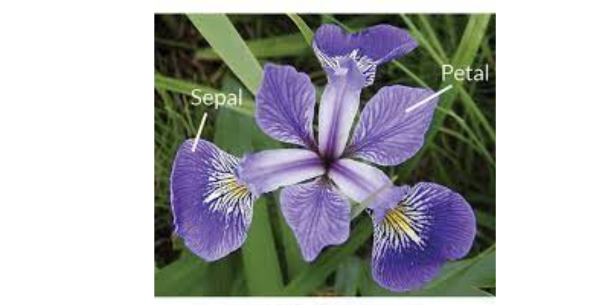

# 🌸 Iris Flower Classification 🌸

A complete machine learning pipeline to classify iris flowers into three species — **Setosa**, **Versicolor**, and **Virginica** using petal and sepal measurements. This project demonstrates data exploration, visualization, model building, evaluation, and hyperparameter tuning, a part of our ongoing "Data Analysis Series".

---

## 📌 Project Overview

This hands-on project focuses on applying core data analysis and machine learning techniques to a well-known classification problem. It reflects the practical application of concepts explored through continuous learning and experimentation with real-world datasets.

---

## 🔍 Dataset

- **Source**: Iris Dataset (CSV file)
- **Features**:
  - `SepalLengthCm`
  - `SepalWidthCm`
  - `PetalLengthCm`
  - `PetalWidthCm`
- **Target**: `Species` (`Setosa`, `Versicolor`, `Virginica`)
- **Samples**: 150 total (50 per class approx)

---

## 📊 Data Exploration & Visualization

- Histogram plots
- Pair plots using Seaborn
- Scatter plots (Sepal vs Petal)
- Boxplots
- Correlation heatmap

> These visualizations helped uncover meaningful relationships between features and highlighted clear patterns that supported model selection.

---

## 🧠 Machine Learning Models Used

- **Logistic Regression**
- **Decision Tree**
- **Random Forest**
- **K-Nearest Neighbors (KNN)**
- **Support Vector Machine (SVM)**

Each model was:
- Trained and evaluated using accuracy, precision, recall, and F1-score
- Validated using **5-fold cross-validation**
- Tuned with **GridSearchCV** (where applicable)

---

## 🏆 Results

| Model              | Avg CV Score |
|-------------------|--------------|
| **K-Nearest Neighbors** | **0.9726** |
| Decision Tree      | 0.9591       |
| Random Forest      | 0.9522       |
| Logistic Regression| 0.9591       |
| SVM                | 0.9591       |

> ✅ **KNN delivered the highest accuracy across folds**, making it a strong candidate for this classification task.

---

## ✅ Project Highlights

- Complete ML pipeline from EDA to model selection
- Visual storytelling with clean, insightful charts
- Cross-validation and hyperparameter tuning
- A continuation of exploratory data science work focused on real-world datasets

---

## 🙋‍♂️ Author

Made by Hashir khan   
Feel free to ⭐ the repo if you found it helpful!
